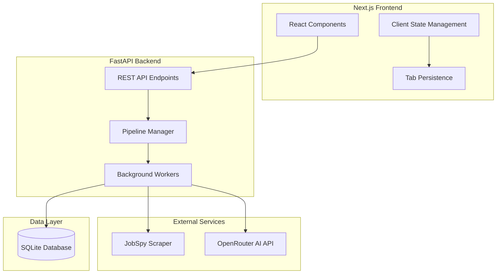
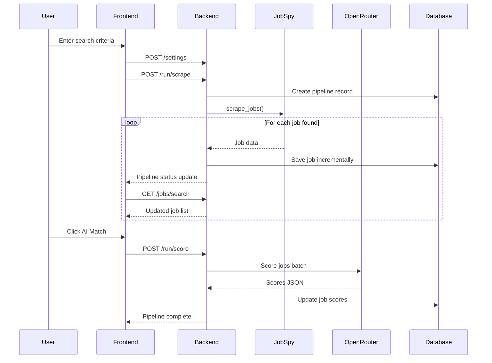

# LinkedIn Job Bot - Comprehensive Project Review

## Executive Summary

This is a **full-stack job search automation application** that scrapes job listings from multiple platforms (LinkedIn, Indeed, Glassdoor, ZipRecruiter) and provides AI-powered job matching using OpenRouter's LLM APIs. The application features a modern React/Next.js frontend with a Python FastAPI backend.

---

## Architecture Overview



---

## Backend Analysis

### Technology Stack

| Component | Technology | Version |
|-----------|------------|---------|
| Web Framework | FastAPI | >=0.100.0 |
| ASGI Server | Uvicorn | >=0.22.0 |
| Database | SQLite + SQLAlchemy | >=2.0.0 |
| Job Scraping | python-jobspy | >=1.1.0 |
| AI Integration | OpenAI SDK | >=1.0.0 |
| Validation | Pydantic | >=2.0.0 |
| Rate Limiting | SlowAPI | >=0.1.9 |

### File Structure

```
backend/
├── main.py           # Main FastAPI application (870 lines)
├── job_bot.py        # Job scraping & AI scoring logic (428 lines)
├── requirements.txt  # Python dependencies
├── jobs.db          # SQLite database (auto-created)
├── .env             # Environment configuration
├── .env.example     # Environment template
├── update_page.py   # Frontend update helper script
├── update_page_ui.py # Frontend UI update helper
└── middleware/
    └── rate_limit.py # Empty - rate limiting not implemented
```

### Database Models

#### JobDB Model
```python
# Stores scraped job listings
- id: String (UUID from URL)
- title, company, location, job_url, description
- is_remote: Boolean
- date_posted, source_site, search_title, search_location
- status: String (new/saved/rejected)
- score: Integer (AI match score 0-100)
- scored: Boolean
- batch_id: String (groups jobs from same search)
- fetched_at: DateTime
```

#### SettingsDB Model
```python
# Stores user configuration
- api_key, api_key_last5, connected
- titles, locations, country
- include_keywords, exclude_keywords
- sites, results_per_site, hours_old
- data_mode, model, candidate_profile
```

### API Endpoints

| Endpoint | Method | Purpose |
|----------|--------|---------|
| `/health` | GET | Health check |
| `/api/countries` | GET | List supported countries |
| `/api/models` | GET | List supported AI models |
| `/api/sites` | GET | List supported job sites |
| `/settings` | GET/POST | Get or save settings |
| `/connect` | POST | Connect OpenRouter API key |
| `/disconnect` | POST | Disconnect API key |
| `/jobs/search` | POST | Search jobs with filters |
| `/jobs/{job_id}` | GET/PATCH/DELETE | Job CRUD operations |
| `/jobs/clear-all` | DELETE | Clear all jobs |
| `/logs/{job_id}` | GET | Get pipeline logs |
| `/run/scrape` | POST | Start scraping pipeline |
| `/run/score` | POST | Start AI scoring pipeline |
| `/stats` | GET | Get job statistics |

### Key Backend Components

#### 1. PipelineManager (Thread-Safe State Management)
- Manages long-running background jobs
- Thread-safe with `threading.Lock()`
- Auto-cleanup of expired pipelines (1 hour TTL)
- Stores logs, state, and stats per pipeline

#### 2. Scraping Logic ([`job_bot.py`](backend/job_bot.py))
- Uses `python-jobspy` library for multi-site scraping
- Supports LinkedIn, Indeed, Glassdoor, ZipRecruiter
- Keyword filtering (include/exclude)
- Incremental saving for real-time UI updates
- Country normalization for JobSpy compatibility

#### 3. AI Scoring System
- Uses OpenRouter API with structured JSON output
- Batch processing (configurable batch size 3-12)
- Scores jobs 0-100 based on candidate profile
- Fallback mode for models without structured output
- Rate limiting with 1-second delays between batches

### Backend Strengths

1. **Clean Architecture**: Well-organized with clear separation of concerns
2. **Thread Safety**: Proper use of locks for concurrent operations
3. **Error Handling**: Comprehensive try-catch blocks with logging
4. **Validation**: Pydantic models with custom validators
5. **Background Tasks**: Non-blocking pipeline execution
6. **Real-time Updates**: Incremental job saving during scraping

### Backend Issues & Concerns

1. **Empty Rate Limiting Middleware**: [`middleware/rate_limit.py`](backend/middleware/rate_limit.py) is empty despite `slowapi` in requirements
2. **API Key Storage**: API keys stored in plaintext in SQLite
3. **No Authentication**: No user authentication system
4. **CORS Wide Open**: `allow_origins=["*"]` is insecure for production
5. **Hardcoded Model List**: Only 2 models supported, not dynamic
6. **No Database Migrations**: Schema changes require manual intervention
7. **Missing Input Sanitization**: Some inputs lack proper sanitization

---

## Frontend Analysis

### Technology Stack

| Component | Technology | Version |
|-----------|------------|---------|
| Framework | Next.js | 16.1.4 |
| UI Library | React | 19.2.3 |
| Styling | Tailwind CSS | 4.x |
| Icons | Lucide React | 0.562.0 |
| Date Utils | date-fns | 4.1.0 |
| Language | TypeScript | 5.x |

### File Structure

```
frontend/
├── app/
│   ├── page.tsx        # Main application (1119 lines)
│   ├── layout.tsx      # Root layout
│   ├── globals.css     # Global styles
│   └── favicon.ico
├── public/             # Static assets
├── package.json
├── tailwind.config.ts
├── tsconfig.json
└── next.config.ts
```

### Frontend Components

#### Main Page Component ([`page.tsx`](frontend/app/page.tsx))

The entire UI is contained in a single 1119-line file with:

1. **Type Definitions**
   - `JobRow`: Job listing data structure
   - `SettingsModel`: User settings
   - `SearchTab`: Tab management
   - `PipelineStatus`: Background job status

2. **Sub-Components**
   - `ErrorToast`: Auto-dismissing error notifications
   - `SkeletonJobRow`: Loading placeholder

3. **State Management** (20+ useState hooks)
   - Jobs, settings, tabs, filters
   - Pipeline status, modals, theme
   - Form inputs for search parameters

4. **Features**
   - Multi-tab search interface
   - Dark/Light theme toggle
   - Real-time job updates during scraping
   - Job status management (new/saved/rejected)
   - Filtering by portal and location
   - Candidate profile management
   - Settings modal with data clearing

### UI/UX Design

```
┌─────────────────────────────────────────────────────────────┐
│  [ManyJobs]                                                 │
├──────────────┬──────────────────────────────────────────────┤
│  SIDEBAR     │  TABS: [All History] [New Search] [+] [⚙️]  │
│              ├──────────────────────────────────────────────┤
│  Job Titles  │  FILTERS: [new|saved|rejected] [Portal▼]    │
│  Locations   │           [Location▼]  [Fetch Jobs]         │
│  Country     ├──────────────────────────────────────────────┤
│              │                                              │
│  Platforms   │  ┌─────────────────────────────────────────┐│
│  [linkedin]  │  │ Job Title - Company                      ││
│  [indeed]    │  │ Location | Date | Portal [✓][✗][🗑️]     ││
│  [glassdoor] │  ├─────────────────────────────────────────┤│
│  [zip_rec..] │  │ ... more jobs ...                        ││
│              │  └─────────────────────────────────────────┘│
│  Settings    │                                              │
│  Max Results ├──────────────────────────────────────────────┤
│  Age Hours   │  STATUS: ● Fetching...  5 new | 2 skipped   │
│              │  [████████████████████████████████████████]  │
│  [Profile]   │                                              │
│  [Keywords]  │                                              │
└──────────────┴──────────────────────────────────────────────┘
```

### Frontend Strengths

1. **Modern Stack**: Next.js 16, React 19, Tailwind 4
2. **Dark/Light Theme**: Proper theme implementation with persistence
3. **Real-time Updates**: Polling for pipeline status
4. **Skeleton Loading**: Good UX during data fetching
5. **Tab Management**: Persistent tabs with localStorage
6. **Responsive Design**: Clean, modern UI
7. **Error Handling**: Toast notifications for errors

### Frontend Issues & Concerns

1. **Monolithic Component**: 1119 lines in single file - should be split
2. **No Component Library**: All components built from scratch
3. **Polling Instead of WebSockets**: 1-second polling is inefficient
4. **No State Management Library**: Complex state with many useState hooks
5. **Missing Error Boundaries**: No React error boundaries
6. **No Unit Tests**: No test files present
7. **Accessibility**: Missing ARIA labels and keyboard navigation
8. **Hardcoded Backend URL**: Falls back to localhost:8000

---

## Data Flow



---

## Security Assessment

### Critical Issues

| Severity | Issue | Location | Recommendation |
|----------|-------|----------|----------------|
| 🔴 High | API keys stored in plaintext | `main.py:388` | Use environment variables or encrypted storage |
| 🔴 High | CORS allows all origins | `main.py:102` | Restrict to known origins |
| 🟡 Medium | No authentication | Entire app | Add user auth for multi-tenant use |
| 🟡 Medium | No rate limiting implemented | `middleware/rate_limit.py` | Implement SlowAPI rate limiting |
| 🟡 Medium | SQL injection potential | Filter inputs | Use parameterized queries (SQLAlchemy does this) |
| 🟢 Low | No HTTPS enforcement | Production deployment | Add HTTPS redirect middleware |

---

## Performance Considerations

### Backend
- **SQLite Limitations**: Not suitable for high concurrency
- **No Caching**: Repeated queries hit database every time
- **Background Tasks**: Good pattern for long-running operations
- **Batch Processing**: AI scoring batches requests efficiently

### Frontend
- **Large Bundle**: Single 1119-line component
- **Polling Overhead**: 1-second intervals create unnecessary requests
- **No Virtualization**: Large job lists may cause performance issues
- **LocalStorage**: Synchronous operations may block UI

---

## Code Quality Assessment

### Strengths
- Consistent code style
- Good use of TypeScript types
- Proper error handling patterns
- Clean API design

### Areas for Improvement
- **Code Organization**: Split large files into modules
- **Testing**: No test coverage
- **Documentation**: Limited inline comments
- **Type Safety**: Some `any` types could be more specific

---

## Recommendations

### High Priority
1. **Implement Rate Limiting**: Use SlowAPI as intended
2. **Secure API Key Storage**: Use encryption or secure vault
3. **Restrict CORS**: Configure allowed origins properly
4. **Split Frontend Components**: Modularize the 1119-line file

### Medium Priority
1. **Add Authentication**: For multi-user support
2. **Implement WebSockets**: Replace polling for real-time updates
3. **Add Database Migrations**: Use Alembic for schema changes
4. **Write Tests**: Unit and integration tests

### Low Priority
1. **Add Error Boundaries**: Better error handling in React
2. **Improve Accessibility**: ARIA labels, keyboard navigation
3. **Add Logging**: Structured logging with levels
4. **Environment Configuration**: Better config management

---

## Conclusion

This is a well-structured job search automation tool with a solid foundation. The architecture is clean with proper separation between frontend and backend. The use of modern technologies (Next.js 16, React 19, FastAPI) is commendable.

**Key Strengths:**
- Clean API design with proper validation
- Real-time job updates during scraping
- Modern, responsive UI with dark/light themes
- AI-powered job matching

**Key Weaknesses:**
- Security concerns (API key storage, CORS)
- Monolithic frontend component
- No test coverage
- Rate limiting not implemented despite dependency

The project is suitable for personal use or as a portfolio piece but would require security hardening before production deployment.
