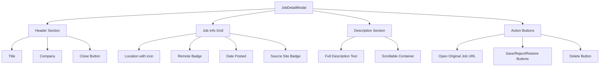
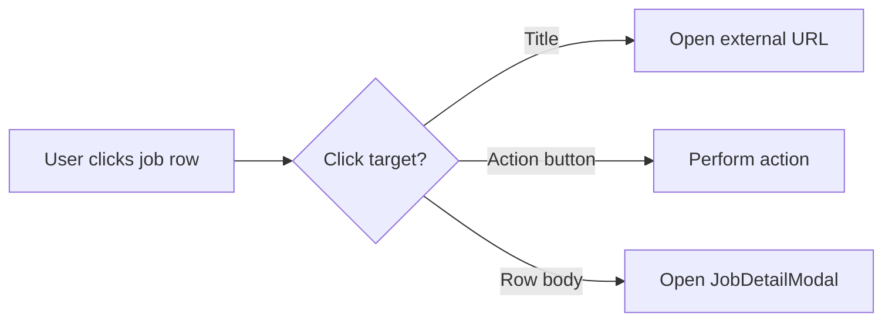

# Task 1: Job Detail Modal

## Overview

Add a modal that displays full job details when user clicks on a job row. The modal should be smooth, fast, and beautifully designed with excellent UX.

## Current State

### Backend - Already Ready
- [`/jobs/{job_id}`](../backend/routes/jobs.py:45) endpoint returns full job details including `description`
- Description is stored in database (truncated to 1200 chars if `data_mode=compact`)

### Frontend - Missing Pieces
- [`JobRow`](../frontend/types/index.ts:2) type does NOT include `description` field
- No modal component exists for job details
- [`JobCard`](../frontend/components/JobCard.tsx) only opens external URL on title click

## Implementation Plan

### Step 1: Update Types

**File:** [`frontend/types/index.ts`](../frontend/types/index.ts)

Add `description` field to `JobRow` type:

```typescript
export type JobRow = {
  id: string;
  title: string;
  company: string;
  location: string;
  job_url: string;
  description: string;  // ADD THIS
  is_remote: boolean;
  date_posted: string;
  source_site: string;
  status: "new" | "saved" | "rejected";
  batch_id: string;
  fetched_at: string;
};
```

### Step 2: Create JobDetailModal Component

**File:** `frontend/components/JobDetailModal.tsx` (NEW)



**Key Features:**
- Smooth enter/exit animations using CSS classes
- Click outside to close
- Escape key to close
- Focus trap for accessibility
- Scrollable description area
- Responsive design for mobile

**Props Interface:**
```typescript
interface JobDetailModalProps {
  job: JobRow | null;
  isOpen: boolean;
  isDark: boolean;
  viewStatus: "new" | "saved" | "rejected";
  onClose: () => void;
  onSave: (id: string) => void;
  onReject: (id: string) => void;
  onRestore: (id: string) => void;
  onDelete: (id: string) => void;
  onOpenUrl: (url: string) => void;
}
```

### Step 3: Update JobCard Component

**File:** [`frontend/components/JobCard.tsx`](../frontend/components/JobCard.tsx)

Changes needed:
1. Add `onJobClick` prop to trigger modal
2. Make entire job row clickable (except action buttons)
3. Keep title click opening external URL as-is



### Step 4: Update page.tsx

**File:** [`frontend/app/page.tsx`](../frontend/app/page.tsx)

Changes needed:
1. Add state for selected job and modal visibility
2. Add `fetchJobById` function to fetch full job details
3. Pass modal handlers to JobList

```typescript
// Add state
const [selectedJob, setSelectedJob] = useState<JobRow | null>(null);
const [isDetailModalOpen, setIsDetailModalOpen] = useState(false);

// Add handler
const handleJobClick = useCallback(async (jobId: string) => {
  try {
    const job = await fetchWithErrorCallback(`${BACKEND}/jobs/${jobId}`) as JobRow;
    setSelectedJob(job);
    setIsDetailModalOpen(true);
  } catch (err) {
    setError(err instanceof Error ? err.message : 'Failed to load job details');
  }
}, [BACKEND, fetchWithErrorCallback]);
```

### Step 5: Add CSS Animations

**File:** [`frontend/app/globals.css`](../frontend/app/globals.css)

Add smooth modal animations:

```css
/* Modal animations */
.modal-enter {
  animation: modalEnter 0.2s ease-out forwards;
}

.modal-exit {
  animation: modalExit 0.15s ease-in forwards;
}

@keyframes modalEnter {
  from {
    opacity: 0;
    transform: scale(0.95) translateY(10px);
  }
  to {
    opacity: 1;
    transform: scale(1) translateY(0);
  }
}

@keyframes modalExit {
  from {
    opacity: 1;
    transform: scale(1) translateY(0);
  }
  to {
    opacity: 0;
    transform: scale(0.95) translateY(10px);
  }
}

/* Job detail modal specific */
.job-detail-content {
  max-height: 60vh;
  overflow-y: auto;
}
```

## UI/UX Design

### Modal Layout

```
+--------------------------------------------------+
|  [X]                                             |
|                                                  |
|  Senior Software Engineer                        |
|  TechCorp Inc.                                   |
|                                                  |
|  +------------+  +------------+  +------------+ |
|  | Location   |  | Remote     |  | 2 days ago | |
|  | Bangalore  |  | Badge      |  |            | |
|  +------------+  +------------+  +------------+ |
|                                                  |
|  +------------------------------------------+   |
|  | LINKEDIN                                  |   |
|  +------------------------------------------+   |
|                                                  |
|  Description                                     |
|  +------------------------------------------+   |
|  | We are looking for an experienced...     |   |
|  |                                          |   |
|  | Requirements:                            |   |
|  | - 5+ years Python experience             |   |
|  | - React/Vue frontend skills              |   |
|  | ...                                      |   |
|  +------------------------------------------+   |
|                                                  |
|  [Open Original] [Save] [Reject] [Delete]        |
+--------------------------------------------------+
```

### Mobile Layout

```
+----------------------------------+
|  [X]                             |
|                                  |
|  Senior Software Engineer        |
|  TechCorp Inc.                   |
|                                  |
|  Bangalore | Remote | 2d ago     |
|                                  |
|  [LINKEDIN]                       |
|                                  |
|  Description                     |
|  +----------------------------+ |
|  | We are looking for...      | |
|  |                            | |
|  | Requirements:              | |
|  | - 5+ years Python          | |
|  | ...                        | |
|  +----------------------------+ |
|                                  |
|  [Open Original]                 |
|  [Save] [Reject] [Delete]        |
+----------------------------------+
```

## Best Practices

### Performance
- Use `memo` for JobDetailModal to prevent unnecessary re-renders
- Lazy load the modal component with `dynamic()`
- Cache fetched job details in parent component

### Accessibility
- Use `useFocusTrap` hook for keyboard navigation
- Add proper ARIA attributes
- Ensure close button has focus on open
- Escape key closes modal

### UX
- Click outside modal closes it
- Smooth animations for open/close
- Loading state while fetching job details
- Error handling with toast notification

## Files to Modify

| File | Action | Changes |
|------|--------|---------|
| `frontend/types/index.ts` | Modify | Add `description` to `JobRow` |
| `frontend/components/JobDetailModal.tsx` | Create | New modal component |
| `frontend/components/JobCard.tsx` | Modify | Add `onJobClick` prop |
| `frontend/components/JobList.tsx` | Modify | Pass `onJobClick` to JobCard |
| `frontend/app/page.tsx` | Modify | Add modal state and handlers |
| `frontend/app/globals.css` | Modify | Add modal animations |

## Testing Checklist

- [ ] Modal opens when clicking job row
- [ ] Modal shows all job details correctly
- [ ] Description is scrollable for long content
- [ ] Click outside closes modal
- [ ] Escape key closes modal
- [ ] Action buttons work correctly
- [ ] Open Original button opens external URL
- [ ] Modal is responsive on mobile
- [ ] Animations are smooth
- [ ] Focus trap works correctly
- [ ] Screen reader compatible