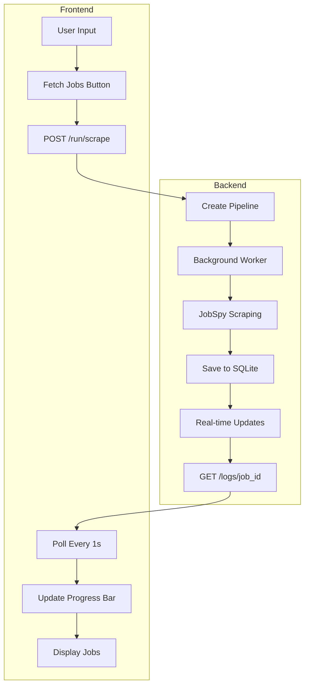

# FindMyJobAI - Project Summary

## Overview
A job search aggregation application that scrapes jobs from LinkedIn, Indeed, and Glassdoor, with AI-powered job matching capabilities. Built with a FastAPI backend and Next.js frontend.

---

## Backend (FastAPI + Python)

### Architecture
- **Framework**: FastAPI with SQLAlchemy ORM
- **Database**: SQLite (`jobs.db`)
- **Job Scraping**: `python-jobspy` library
- **AI Integration**: OpenRouter API for job scoring

### Key Files
| File | Purpose |
|------|---------|
| [`main.py`](backend/main.py) | FastAPI app, API routes, background workers |
| [`job_bot.py`](backend/job_bot.py) | Scraping logic, AI scoring functions |
| [`requirements.txt`](backend/requirements.txt) | Python dependencies |
| [`middleware/rate_limit.py`](backend/middleware/rate_limit.py) | Empty - not implemented |

### API Endpoints
- `GET /health` - Health check
- `GET/POST /settings` - User settings management
- `POST /connect`, `POST /disconnect` - API key management
- `POST /jobs/search` - Search jobs with filters
- `GET/PATCH/DELETE /jobs/{id}` - Single job operations
- `DELETE /jobs/clear-all` - Clear all jobs
- `POST /run/scrape` - Start scraping pipeline
- `POST /run/score` - Start AI scoring pipeline
- `GET /logs/{job_id}` - Pipeline status/logs
- `GET /stats` - Job statistics

### Data Models
- **JobDB**: id, title, company, location, job_url, description, is_remote, date_posted, source_site, status, score, scored, batch_id, fetched_at
- **SettingsDB**: API key, titles, locations, country, keywords, sites, results_per_site, hours_old, candidate_profile

### Supported Sites
- LinkedIn
- Indeed
- Glassdoor
- Zip Recruiter ⚠️ (marked for removal)

---

## Frontend (Next.js + React)

### Architecture
- **Framework**: Next.js 16 with React 19
- **Styling**: Tailwind CSS 4
- **Icons**: Lucide React
- **Date Handling**: date-fns

### Key Files
| File | Purpose |
|------|---------|
| [`app/page.tsx`](frontend/app/page.tsx) | Main application (~470 lines, refactored) |
| [`types/index.ts`](frontend/types/index.ts) | TypeScript type definitions |
| [`lib/constants.ts`](frontend/lib/constants.ts) | App constants (countries, platforms, etc.) |
| [`lib/utils.ts`](frontend/lib/utils.ts) | Utility functions (storage, fetch, debounce) |
| [`components/JobCard.tsx`](frontend/components/JobCard.tsx) | Job display component |
| [`components/MobileNav.tsx`](frontend/components/MobileNav.tsx) | Mobile navigation drawer |
| [`components/DesktopSidebar.tsx`](frontend/components/DesktopSidebar.tsx) | Desktop search sidebar |
| [`components/TabsBar.tsx`](frontend/components/TabsBar.tsx) | Tab navigation |
| [`components/FilterBar.tsx`](frontend/components/FilterBar.tsx) | Job filters and status tabs |
| [`components/JobList.tsx`](frontend/components/JobList.tsx) | Job listing with empty states |
| [`components/EmptyState.tsx`](frontend/components/EmptyState.tsx) | Empty state illustrations |
| [`components/ProgressBar.tsx`](frontend/components/ProgressBar.tsx) | Scraping progress indicator |
| [`components/ErrorToast.tsx`](frontend/components/ErrorToast.tsx) | Error notification |
| [`components/LoadingScreen.tsx`](frontend/components/LoadingScreen.tsx) | Initial loading screen |
| [`components/ProfileModal.tsx`](frontend/components/ProfileModal.tsx) | Candidate profile editor |
| [`components/SettingsModal.tsx`](frontend/components/SettingsModal.tsx) | App settings modal |
| [`components/ClearConfirmModal.tsx`](frontend/components/ClearConfirmModal.tsx) | Data clear confirmation |

### Features
- Tab-based search management with localStorage persistence
- Real-time progress updates during scraping (1s polling)
- Dark/Light theme support
- Mobile-responsive design with drawer navigation
- Job status management (new/saved/rejected)
- Filter by portal and location
- AI-powered job matching (requires OpenRouter API key)

---

## Issues & Improvements Needed

### Backend Issues
1. **Rate Limiting Not Implemented** - [`middleware/rate_limit.py`](backend/middleware/rate_limit.py) is empty
2. **Zip Recruiter** - Still in supported sites, needs removal
3. **Hardcoded Paths** - Update scripts have hardcoded Windows paths
4. **Error Handling** - Some endpoints lack detailed error messages

### Frontend Issues
1. ✅ **Large Component** - [`page.tsx`](frontend/app/page.tsx) refactored from ~2000 lines to ~470 lines
2. ✅ **Debug Logs** - Console logs (`🐰`) removed from production code
3. ✅ **Backup File** - [`page.tsx.backup`](frontend/app/page.tsx.backup) removed
4. ✅ **Duplicate Constants** - `SUPPORTED_COUNTRIES` and `JOB_PLATFORMS` now centralized in [`lib/constants.ts`](frontend/lib/constants.ts)

### General Issues
1. **No Tests** - Missing test coverage for both frontend and backend
2. **No CI/CD** - No automated testing/deployment pipeline
3. **Environment Config** - `.env` handling could be improved

---

## Data Flow



---

## Configuration

### Backend Environment Variables
```
OPENROUTER_API_KEY=your_api_key
```

### Frontend Environment Variables
```
NEXT_PUBLIC_BACKEND_URL=http://localhost:8000
```

---

## Quick Start

### Backend
```bash
cd backend
python -m venv .venv
.venv\Scripts\activate  # Windows
pip install -r requirements.txt
uvicorn main:app --reload --port 8000
```

### Frontend
```bash
cd frontend
npm install
npm run dev
```

---

## Notes for Improvement

### User to Fill In
- [ ] Specific UI issues to fix
- [ ] Edge cases to handle
- [ ] Features to add
- [ ] Performance improvements needed
- [ ] Additional job sites to support
